# Github 블로그에 Google Adsense 넣기 1편

## 시작하며

- Google Adsense 는 광고를 넣을 사이트의 소유권 확인 및 승인 요청을 해야하며, 몇일의 기간을 기다려합니다.
- 1편은 "블로그 소유권 확인" 후 "승인 요청" 까지의 글을 작성하였습니다.
- 승인 이후의 내용은 2편에서 진행하겠습니다.

---

## 나의 블로그 환경

- 나의 블로그는 아래와 같이 개발하였다.
- 프론트엔드 : React + Vite.js + Typescript + TailwindCSS
- 게시글 관리 : Markdown
- 호스팅 : Github Pages

---

## 블로그 소유권 확인

### 01. Google Adsense 접속

- [Google Adsense](https://adsense.google.com/) 에 접속합니다.
- 회원가입이 필요한 경우 구글 계정으로 진행하면됩니다.

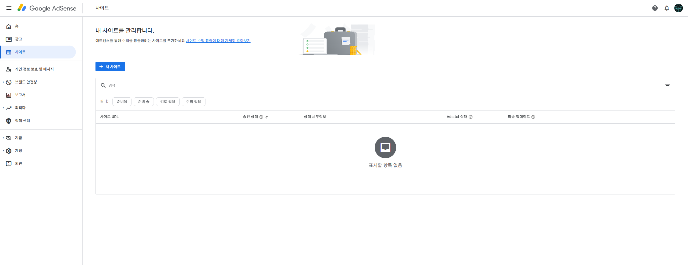

### 02. 사이트 추가

1. 광고를 넣을 사이트를 추가합니다.
    - **[+ 내 사이트] 버튼** 클릭
    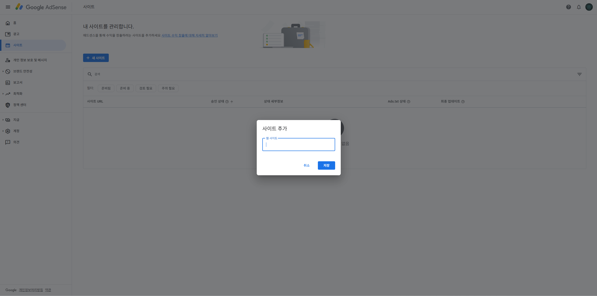

2. 블로그 주소 넣고 **[저장] 버튼** 클릭
    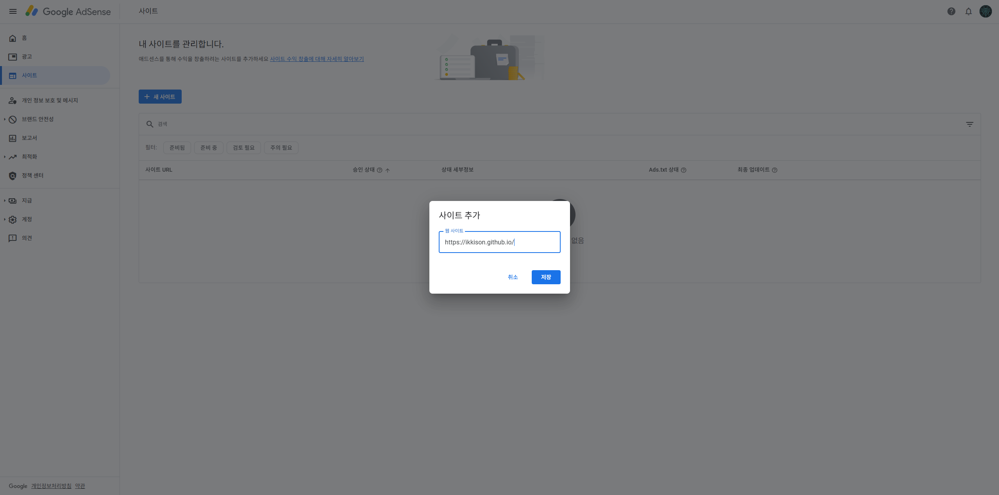

3. 아래의 화면이 나오면 이제 블로그의 소유권을 확인할 겁니다.

    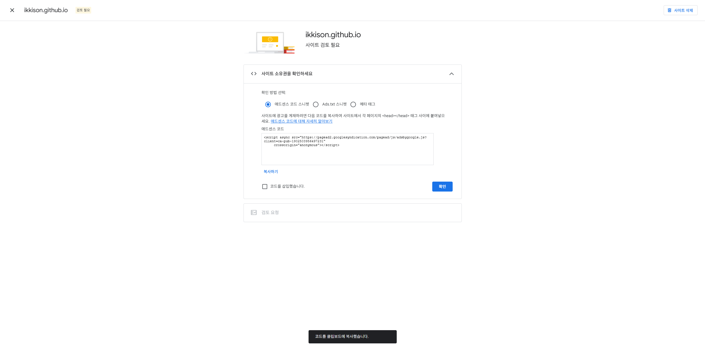

### 03. 소유권 확인

1. 깃허브 블로그 확인

    - 소유권을 확인하기 전, 깃허브 블로그가 "멀쩡한 사이트" 인지가 중요합니다.
        - [x] 실제 접속이 가능한지
        - [x] 콘텐츠(글, 이미즈 등) 이 있는지
    - 광고만 있는 빈사이트는 승인이 거부될 수 있습니다.

2. 사이트 소유권을 확인하기 위해 제공하는 **검증 코드** 를 사이트에 넣어야합니다.

    - vite로 개발했으니 **애드센스 코드 스니펫** 을 선택합니다.

    

3. html에 애드센스 코드를 추가합니다.

    - React/Vite 이니 index.html 에 추가합니다.
    - 이걸 반드시 index.html의 **head** 안쪽에 추가해야합니다.
  
    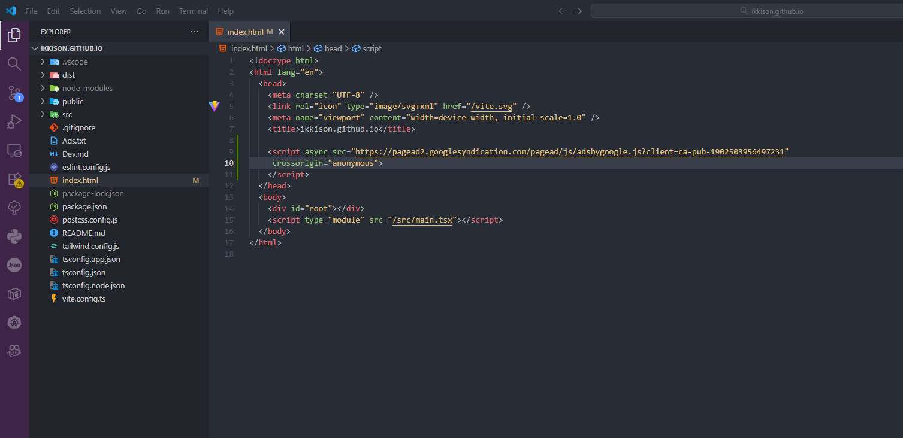

    > ⚠️ 주의:\
    > 광고 태그를 React 코드 내부에 넣는 게 아니라, \
    > 검토용으로는 반드시 HTML의 head 태그 에 직접 추가해야 함.

4. deploy & github push

    - npm 배포 스크립트를 실행하고, 깃허브에 commit/push 합니다.
    - npm 배포 스크립트

        ```shell
        npm run deploy
        ```

    - github push

        ```shell
        git status
        git add .
        git commit -m "add google adsense code"
        git push
        ```

    - 깃허브 확인
        - **index.html** 의 commit 을 확인합니다.
        - 화면 우측 **Deployment** 에서 **github-pages** 가 deploy 되었는지 확인합니다.

        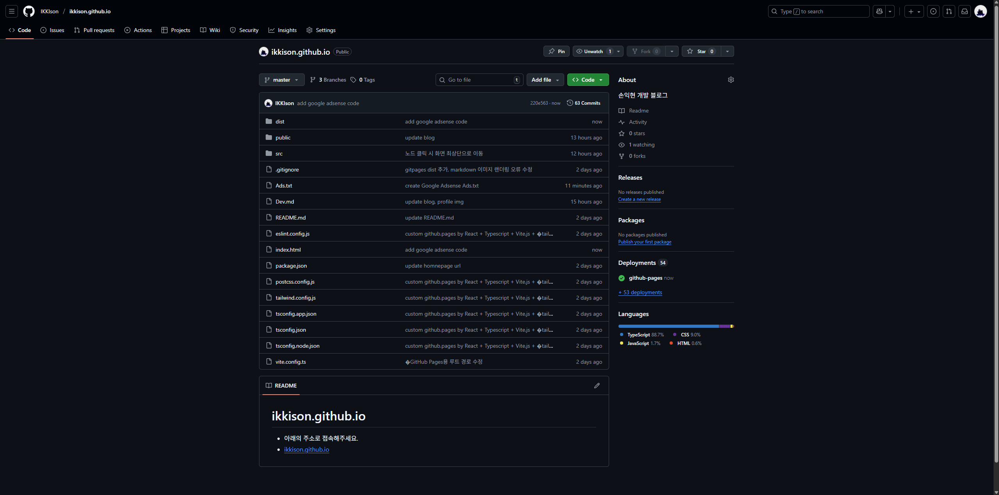

    > ⚠️ 배포? \
    > 저는 npm run deploy 라는 github-pages 를 배포를 위한 스크립트 작업을 별도로 먼저 하였습니다.

5. 소유권 확인하기

    - 이제 코드를 삽입하였으니 소유권을 확인합니다.

    - 좌측하단에 **코드를 삽입했습니다.** 체크 후 우측하단에 **[확인] 버튼** 클릭

        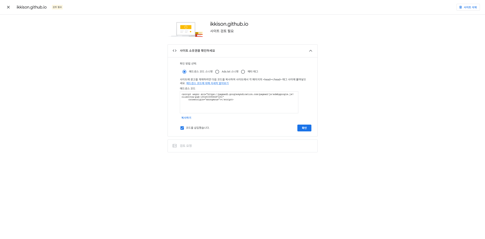

    - 소유권 확인 완료

        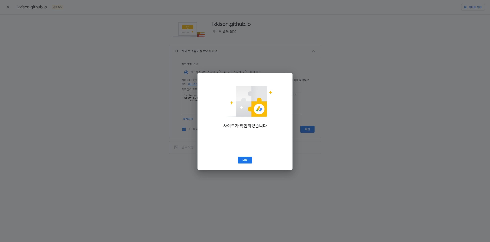

    - **[확인] 버튼** 클릭

        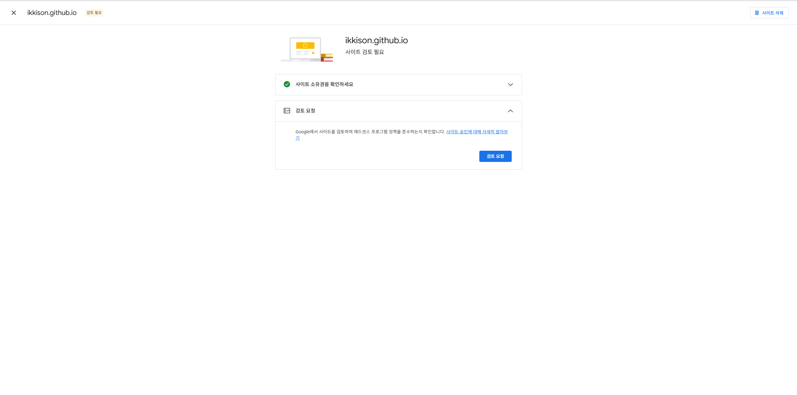

### 04. 검토 요청

- 이제 광고를 넣기 위해 승인을 받아야합니다.

1. 검토 요청 허가

    - 우측 하단 **[검토 요청] 버튼** 클릭

        

2. 검토 요청 완료

    - 완료되면 아래와 같은 화면이 뜹니다.

        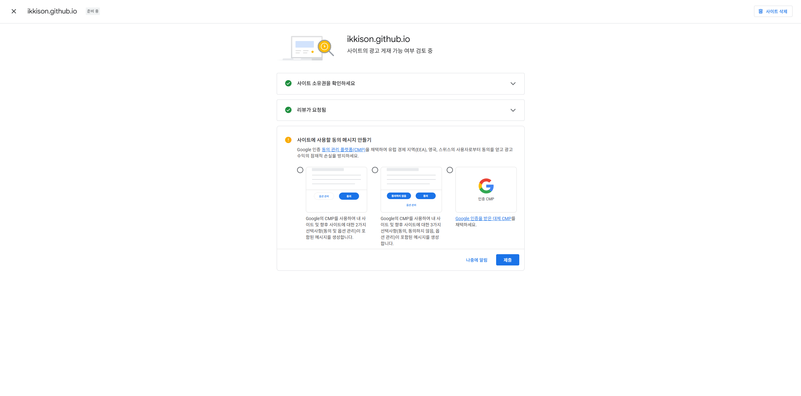

        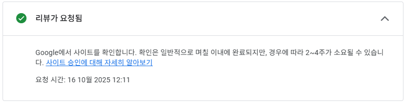

### 05. "사이트에 사용될 동의 메시지 만들기"

1. 사이트에 사용할 동의 메시지 만들기" 단계는 Google AdSense의 개인정보 보호 규정 (GDPR / CCPA 대응) 절차입니다.
    - 즉, 방문자에게 쿠키 사용에 동의받기 위한 팝업을 설정하는 겁니다.

2. 이게 왜 필요한데?
    - AdSense는 유럽(EU), 미국 캘리포니아 등 일부 지역 법규에 따라 방문자의 개인정보 추적(쿠키) 을 하기 전에 "광고 개인화 동의" 메시지를 보여줘야 함.
    - 이걸 설정하지 않으면 승인이 지연되거나 일부 지역 광고가 제한될 수 있어.

3. 아래와 같이 3가지 "동의 메시지(CMP)"를 설정하는 단계입니다.

| 선택 | 설명 |
|-----|------|
| 🔹선택지 1 | "동의 및 옵션 관리" (2가지 선택) |
|           | Google의 CMP를 사용하여 내 사이트 및 향후 사이트에 대한 2가지 선택사항(동의 및 옵션 관리)이 포함된 메시지를 생성. |
|           | 방문자가 광고 쿠키 사용에 "동의" 또는 "옵션 관리" 두 가지 버튼만 보게 됨. |
|           | 간단하고 기본적인 동의창 형태. |
|           | 대부분의 블로그·개인 사이트는 이 옵션으로 충분함. |
|           | Google이 자동으로 EU/EEA/UK/스위스 방문자에게만 메시지를 띄워줌. |
|           | ✅ 추천: 일반적인 블로그나 개인 사이트 운영자에게 가장 적합. |
| 🔹선택지 2 | "동의하지 않음 / 동의 / 옵션 관리" (3가지 선택) |
|           | 동의하지 않음" 버튼이 추가된 버전 |
|           | 방문자에게 "동의하지 않음" 버튼을 명시적으로 보여줌. |
|           | 법적으로 더 엄격한 GDPR 완전 대응 형태. |
|           | 디자인적으로 버튼이 하나 더 생김. |
|           | 일부 사용자는 ‘동의하지 않음’을 눌러 광고 수익이 줄 수 있음. |
|           | ✅ 추천: 상업적 서비스 사이트나 EU 트래픽이 많은 경우. |
| 🔹선택지 3 | "Google 인증 CMP 사용" |
|           | 제3자 CMP(Consent Management Platform)를 직접 선택해서 연동하는 방식. |
|           | 이미 외부 쿠키 동의 시스템(예: Cookiebot, OneTrust)을 사용 중일 때만 선택. |
|           | React 블로그에서는 직접 구현 부담이 크므로 비추천. |
|           | ❌ 일반적인 경우 선택하지 말 것. |
| | |

- 애드센스 대쉬보드에서 별도로 할 수 있으나, 지금 미리 설정해두도록 할께요.

- 저는 간단한 사이트 이므로 첫 번째 옵션(2가지 선택: "동의" + "옵션 관리") 를 고르고 **[제출] 버튼** 을 클릭합니다.

    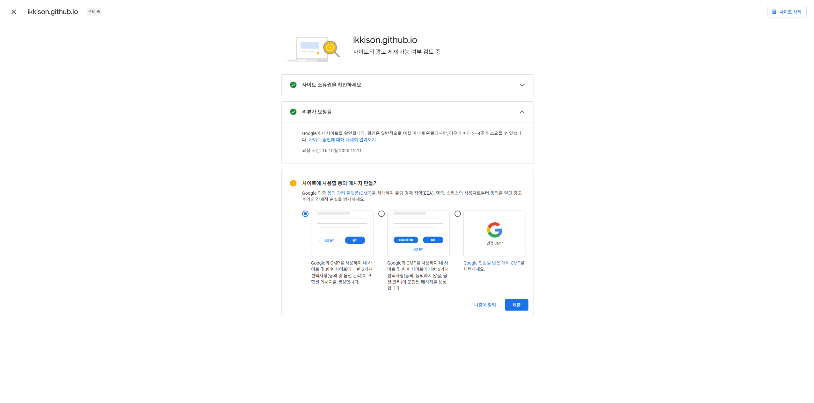

- 제출 완료

    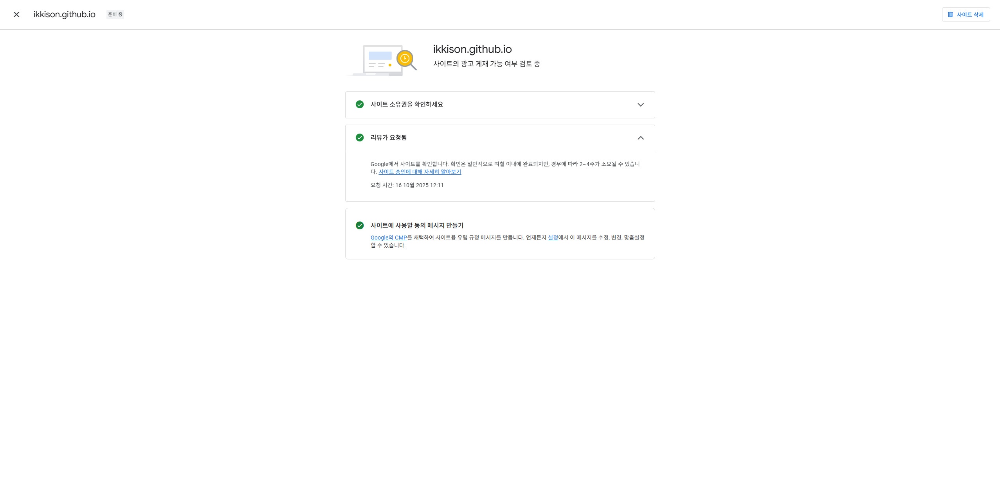

### 06. 완료

- 모든 작업이 완료되었습니다.

    

- 이제 승인 완료를 기다리면 됩니다.

---

## 마치며

- 예전의 만든 JekyII 블로그는 프론트엔드 개발경험없는 나에게 UI를 "딸깍" 변경이 좋았어요.
- 그러나 테마별로 Directory Structure가 일관성이 없으며, 편하게 광고를 넣기 위해 Tistory 로 잠시 블로그를 하였습니다.
- 이제는 내가 직접 원하는 걸 만들고 싶어 직접 만든 나의 홈페이지에 광고를 넣어보려합니다.
