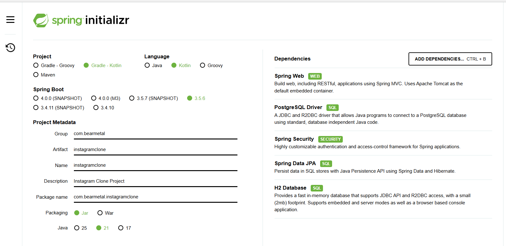
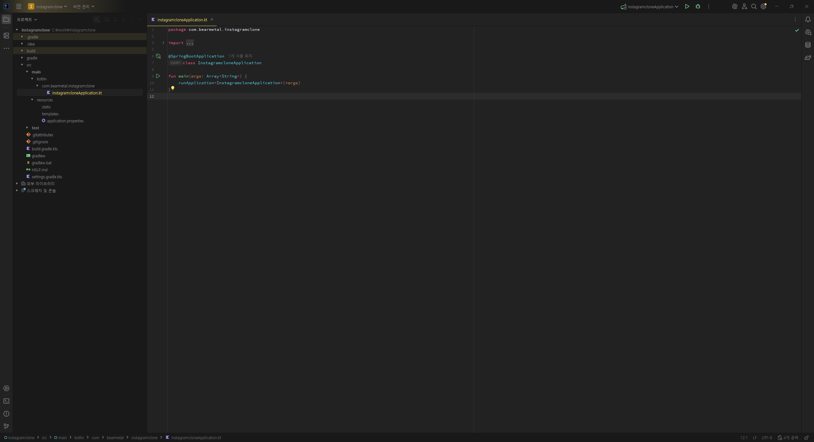

# 개발환경 02 SpringBoot

- [01 PostgreSQL](./03_setup_01_PostgreSQL.md)
- **02 SpringBoot**
- [03 SpringSecurity](./03_setup_03_SpringSecurity.md)
- [04 H2](./03_setup_04_H2.md)
- [05 Retrofit](./03_setup_05_Retrofit.md)
- [06 queryDSL](./03_setup_06_queryDSL.md)
- [07 Swagger](./03_setup_07_Swagger.md)
- [08 JWT](./03_setup_08_JWT.md)

---

## 🖥️ Tech Stack

| list             | Spec |
|------------------|-------------|
| **IDE**          | IntelliJ by Jetbrain  |
| **JDK**          | Adoptium jdk-21.0.8.9-hotspot |
| **Spring Boot**  | 3.5.6 |
| **Language**     | Kotlin |
| **Build Tool**   | Gradle-Kotlin |
| **Packaging**    | Jar |
| **Dependencies** | Spring Web / Spring Security / Spring Data JPA / H2 Database / PostgreSQL Driver |
| | |

---

## start.spring.io

- 프로젝트 생성을 위해 [start.spring.io](https://start.spring.io/) 에서 아래와 같이 설정하여 **[Generate] 버튼** 클릭

---

## 프로젝트 시작

- IntelliJ 로 프로젝트를 열고 IntelliJ 가 Indexing / Setup 을 완료할 때까지 하도록 기다린다.

---

## 마치며

- 이제 Spring Security 설정을 통해 개발, 배포 상황을 고려한 기본 설정을 진행할 것이다.
