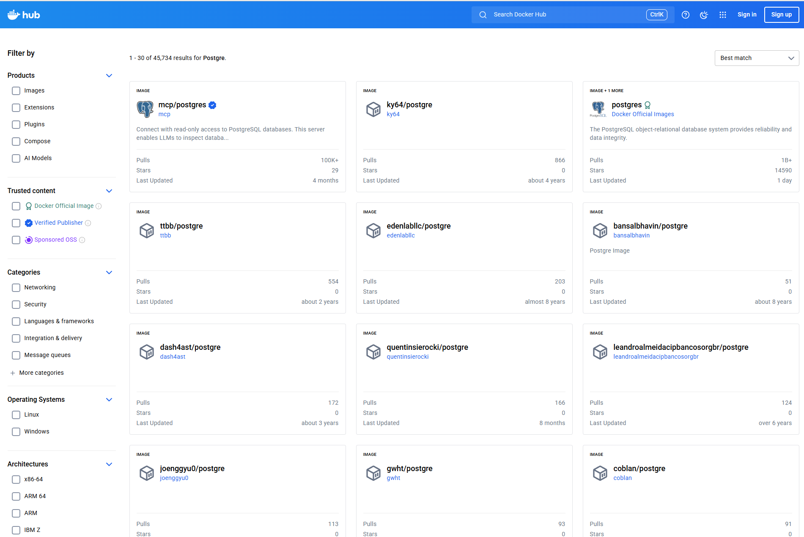
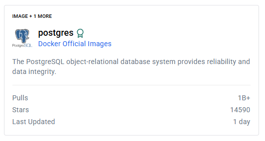

# 개발환경 Setup 01 PostgreSQL

- [01 PostgreSQL](./03_setup_01_PostgreSQL.md)
- [02 SpringBoot](./03_setup_02_SpringBoot.md)
- [03 Logger](./03_setup_03_Logger.md)
- [04 Retrofit](./03_setup_04_Retrofit.md)
- [05 Swagger](./03_setup_05_Swagger.md)
- [06 SpringSecurity](./03_setup_06_SpringSecurity.md)
- [07 H2](./03_setup_07_H2.md)
- [08 JWT](./03_setup_08_JWT.md)
- [09 queryDSL](./03_setup_09_queryDSL.md)

---

## 🖥️ Tech Stack

| list                | Spec |
|---------------------|-------------|
| **IDE**             | DataGrip |
| **Container**       | Docker |
| **Trusted content** | Docker Official Image |
| **Image Name**      | postgres |
| **Image Tag**       | 16 |
| | |

---

## PostgreSQL Docker Overview

- Docker를 이용하여 PostgreSQL 을 사용

- [Docker Hub](https://hub.docker.com/) 에서 PostgreSQL Docker Official Image 사용

1. Docker Hub Search PostgreSQL

    

2. Docker Offical Image

    

3. Docker Offical Image

    - Offical 이미지를 클릭
    - [PostgreSQL Docker Offical Image Page](https://hub.docker.com/_/postgres)
    - 해당 페이지에서 Docker 실행 방법과 계정 기본 설정, 환경 설정 등이 설명되어 있으니 상황에 맞게 사용.

    

---

## Docker Script

- 아래의 스크립트는 실제로 사용하는 저의 스크립트의 기본 형태입니다.
- 자주 사용하는 형태를 스크립트로 만들어 재사용하고 있습니다.
- 최소 동작가능한 중요한 스크립트 내용만 설명하고 있으니, 입맛대로 자유롭게 변경해가며 사용하면 됩니다.

1. 이미지 받기

    ```shell
    #!/bin/bash

    DOCKER_IMAGE_NAME=postgres
    DOCKER_IMAGE_TAG="16"

    # 이미지 받기
    docker pull ${DOCKER_IMAGE_NAME}:${DOCKER_IMAGE_TAG}

    # 이미지 목록 확인
    docker images
    ```

2. 도커 실행

    ```shell
    #!/bin/bash

    DOCKER_IMAGE_NAME=postgres
    DOCKER_IMAGE_TAG="16"

    DOCKER_CONTAINER_NAME=${DOCKER_IMAGE_NAME}_${DOCKER_IMAGE_TAG}
    DOCKER_CONTAINER_NAME=${DOCKER_CONTAINER_NAME//-/"."} # 버전에 "." 혹은 "-" 이 포함된 문자열이면 제거

    LOG_DRIVER=none     # none, json-file, syslog, journald, gelf, fluentd, awslogs, splunk, etwlogs, gcplogs
    LOG_OPT_MAX_SIZE=1m # 각 로그 파일 최대 크기
    LOG_OPT_MAX_FILE=1  # Rotate, 최대 로그 파일 개수

    HOST_PORT=5432      # 포트포워딩 : Host Post
    CONTAINER_PORT=5432 # 포트포워딩 : Guest Post
    TIMEZONE=Asia/Seoul # Container OS's TZ
    POSTGRES_PASSWORD=P@ssw0rd # postgres 비밀번호
    # POSTGRES_CONF : /var/lib/postgresql/data/postgresql.conf
    HOST_DATA=./data                       # container에 저장되는 postgre 데이터 공유
    POSTGRES_DATA=/var/lib/postgresql/data # container에 저장되는 postgre 데이터 공유

    RUN_OPT=""
    RUN_OPT=${RUN_OPT}" --rm" # container stop 시 container 자동 삭제
    RUN_OPT=${RUN_OPT}" -d" # container daemon(-d) / foreground(-it)
    RUN_OPT=${RUN_OPT}" --cidfile .container_id" # container id 값을 ".container_id" 파일로 저장하여 stop/exec 등 해당 container 작업 시 용이

    # PostgreSQL 도커 실행
    docker run $RUN_OPT \
        --log-driver ${LOG_DRIVER} \
        --name ${DOCKER_CONTAINER_NAME} \
        -p ${HOST_PORT}:${CONTAINER_PORT} \
        -e TZ=${TIMEZONE} \
        -e POSTGRES_PASSWORD=${POSTGRES_PASSWORD} \
        -v ${HOST_DATA}:${POSTGRES_DATA} \
        ${DOCKER_IMAGE_FULL_NAME}

    # !!! 주의 !!!
    # --log-driver 가 none 인경우 --log-opt 를 사용하면 안됩니다.
    # none 아닌 경우에만 추가합니다.
    # --log-opt max-size=${LOG_OPT_MAX_SIZE} \
    # --log-opt max-file=${LOG_OPT_MAX_FILE} \

    # 실행 중인 container 확인
    docker ps

    # 전체 container 확인
    docker ps -a

    # PostgreSQL도커 container id 가 저장되었는지 확인
    cat ./container_id

    ```

    - **--log-driver** 가 **none** 인 이유
        - 저는 container 안에서 실행되는 실제 서버/프로세스의 로그를 **-v** 옵션으로 Host 와 공유하여 관리하는 것을 선호합니다.
        - **--log-opt**의 경우 예시 설명을 위해 굳이 추가하였습니다.
        - **--log-driver** 값을 판단해 **RUN_OPT** 에 **--log-opt** 들을 자동으로 append 할 수 있지만, 현재 포스팅 의도와 크게 벗어나는 내용이므로 제외합니다.
    - HOST_DATA, POSTGRES_DATA
        - HOST_DATA 와 POSTGRES_DATA 를 공유하여 Container가 바뀌거나 이관/통합 등의 상황에서 실제 저장된 data들을 그대로 사용하기 위해 -v 옵션으로 공유하여 Host에서 관리할 수 있도록 합니다.
        - 데이터 뿐만 아니라 PostgreSQL서버의 설정파일 역시 위에 POSTGRES_DATA 경로에 저장됩니다.
            - postgresql.conf 경로 : /var/lib/postgresql/data/postgresql.conf

3. 도커 중지

    ```shell
    #!/bin/bash

    DOCKER_IMAGE_NAME=postgres
    DOCKER_IMAGE_TAG="16"

    DOCKER_CONTAINER_NAME=${DOCKER_IMAGE_NAME}_${DOCKER_IMAGE_TAG}
    DOCKER_CONTAINER_NAME=${DOCKER_CONTAINER_NAME//-/"."}

    # is exists .container_id file
    if [ ! -f "./.container_id" ]; then
        echo ".container_id 파일을 찾을 수 없습니다. 컨테이너가 실행 중인지 확인하세요?"
        docker ps --filter "name=${DOCKER_CONTAINER_NAME}" --format "table {{.ID}}\t{{.Names}}\t{{.Status}}" 
        exit 1
    fi

    # is empty .container_id file
    CONTAINER_ID=$(cat "./.container_id")
    if [ -z "${CONTAINER_ID}" ]; then
        echo ".container_id 파일에 값이 없습니다. 컨테이너가 실행 중인지 확인하세요?"
        docker ps --filter "name=${DOCKER_CONTAINER_PREFIX_NAME}" --format "table {{.ID}}\t{{.Names}}\t{{.Status}}" 
        exit 1
    fi

    # Container 중지
    docker stop ${CONTAINER_ID}

    docker ps

    docker ps -a
    ```

4. 도커 컨테이너 진입(/bin/bash 터미널 접속)

    ```shell
    #!/bin/bash

    DOCKER_IMAGE_NAME=postgres
    DOCKER_IMAGE_TAG="16"

    DOCKER_CONTAINER_NAME=${DOCKER_IMAGE_NAME}_${DOCKER_IMAGE_TAG}
    DOCKER_CONTAINER_NAME=${DOCKER_CONTAINER_NAME//-/"."}

    # is exists .container_id file
    if [ ! -f "./.container_id" ]; then
        echo ".container_id 파일을 찾을 수 없습니다. 컨테이너가 실행 중인지 확인하세요?"
        docker ps --filter "name=${DOCKER_CONTAINER_NAME}" --format "table {{.ID}}\t{{.Names}}\t{{.Status}}" 
        exit 1
    fi

    # is empty .container_id file
    CONTAINER_ID=$(cat "./.container_id")
    if [ -z "${CONTAINER_ID}" ]; then
        echo ".container_id 파일에 값이 없습니다. 컨테이너가 실행 중인지 확인하세요?"
        docker ps --filter "name=${DOCKER_CONTAINER_PREFIX_NAME}" --format "table {{.ID}}\t{{.Names}}\t{{.Status}}" 
        exit 1
    fi

    docker exec -it ${CONTAINER_ID} /bin/bash
    ```

5. 도커 컨테이너 로그

    ```shell
    #!/bin/bash

    DOCKER_IMAGE_NAME=postgres
    DOCKER_IMAGE_TAG="16"

    DOCKER_CONTAINER_NAME=${DOCKER_IMAGE_NAME}_${DOCKER_IMAGE_TAG}
    DOCKER_CONTAINER_NAME=${DOCKER_CONTAINER_NAME//-/"."}

    # is exists .container_id file
    if [ ! -f "./.container_id" ]; then
        echo ".container_id 파일을 찾을 수 없습니다. 컨테이너가 실행 중인지 확인하세요?"
        docker ps --filter "name=${DOCKER_CONTAINER_NAME}" --format "table {{.ID}}\t{{.Names}}\t{{.Status}}" 
        exit 1
    fi

    # is empty .container_id file
    CONTAINER_ID=$(cat "./.container_id")
    if [ -z "${CONTAINER_ID}" ]; then
        echo ".container_id 파일에 값이 없습니다. 컨테이너가 실행 중인지 확인하세요?"
        docker ps --filter "name=${DOCKER_CONTAINER_PREFIX_NAME}" --format "table {{.ID}}\t{{.Names}}\t{{.Status}}" 
        exit 1
    fi

    docker logs -f ${CONTAINER_ID}
    ```

    - **docker run** 시 **--log-driver none** 인 경우 로그가 없으므로 **docker logs** 명령어를 사용할 수 없습니다.

---

## 마치며

- 추후 배포/운영 환경까지 고려하여 간단한게 Docker 이미지를 활용하는 것을 선호합니다.
- 특히, H2 보다는 실제 DBMS와 연동하여 개발하는 것을 좋아합니다.
- PostgreSQL 도커 이미지 네이밍과 명령어를 고려할 때, **"postgres"** 라고 네이밍 하는것이 용이해 보입니다.
